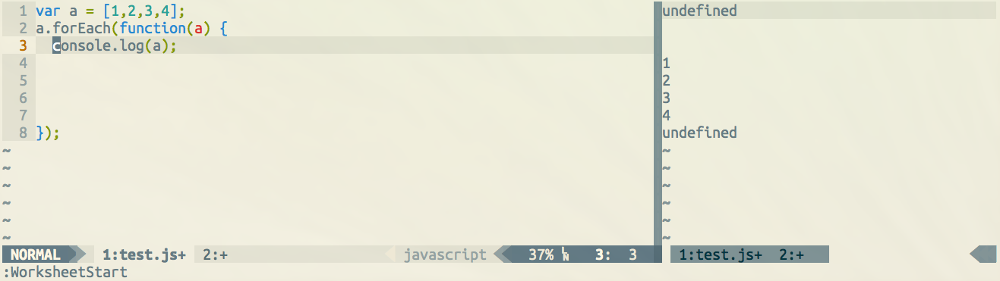

Vim Worksheet
=============

Add worksheet support to Vim.

Installation
============
NeoBundle Recommended

add this line to your .vimrc

`NeoBundle HerringtonDarkholme/vim-worksheet`

Usage
===========
Currently it supports scala and js.

**Command:**

`:WorksheetStart` start worksheet session
`:WorksheetEval`  evaluate script and print worksheet
`:WorksheetClean` clean previous worksheet result
`:WorksheetEnd`   close worksheet session and clean up

**Shortcut**
`<leader>ws` WorksheetStart
`<leader>wc` WorksheetClean
`<leader>we` WorksheetEnd

TODO
=======

* Configuration:
    It only satisifies my need now.
* Inline mode
    Output repl result in the same buffer, in the same line
* Appending mode
    Output repl result in the same buffer, in the next line
